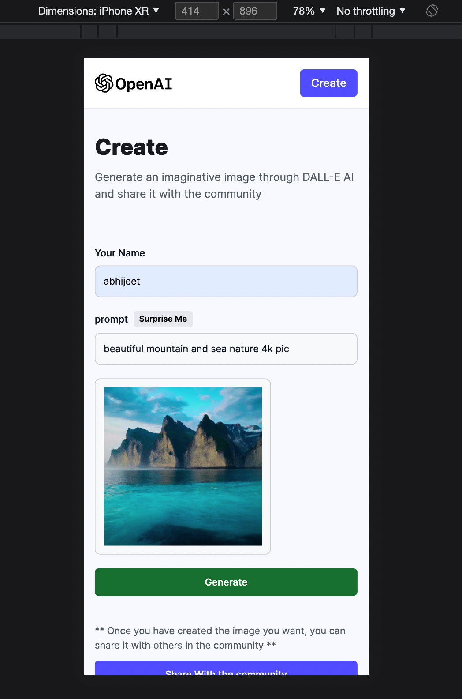

# [AI Image Generator](https://ai-image-generator-mern.netlify.app)

## Description

AI Image Generator Full Stack MERN App, where user can generate ai image by writing prompt, and user can share that image with Community.

## Tech Stack 💻

### Frontend

- React,
- React Router Dom,
- Tailwind css

### Backend

- node,
- express,
- mongodb,
- mongoose,
- openai,
- cloudinary

## Features ✨

- Community Showcase All Images
- Searching Images.
- AI Image Generator with prompts
- Responsive website for mobile, Table and PC devices.

## Link

https://ai-image-generator-mern.netlify.app

## How to run locally ?

1.  clone
    ```
     git clone https://github.com/bkabhi/ai-image-generator
    ```
2.  Install node_modules
    ```
     npm i
    ```
3.  start it
    ```
    npm run start
    ```

## Screenshots 📸

#### Community Showcase page

<!--  -->


## Community Showcase page (Responsive) ;


#### AI Image Generator page


## AI Image Generator page (Responsive) ;



## Contributor 😇

- 👤 [Abhijeet Kumar](https://github.com/bkabhi)
